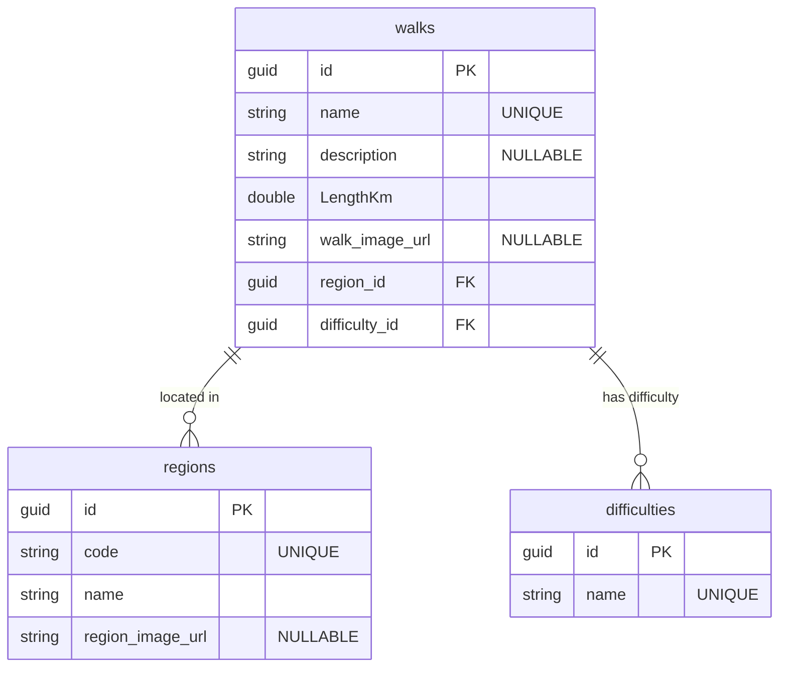

```mermaid
erDiagram
    walks {
        guid id PK
        string name "UNIQUE"
        string description "NULLABLE"
        double LengthKm
        string walk_image_url "NULLABLE"
        guid region_id FK
        guid difficulty_id FK
    }
    
    regions {
        guid id PK
        string code "UNIQUE"
        string name
        string region_image_url "NULLABLE"
    }
    
    difficulties {
        guid id PK
        string name "UNIQUE"
    }
    
    walks ||--o{ regions : "located in"
    walks ||--o{ difficulties : "has difficulty"
```